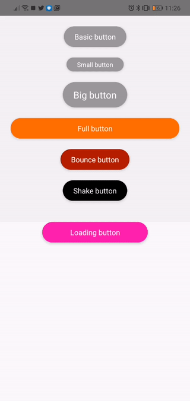

# react-native-buttons
A collection of react-native buttons

## Usage

    import {BasicButton} from '@phomea/react-native-buttons';

    <BasicButton title="Basic button" />

## Props

| prop |type| default | values |
|-|-|-|-|
|animation|string|standard|standard,bounce,shake|
|color|string|grey|white,black,pink,orange,red,grey,darkGrey,lightGrey|
| textStyle| style | {} ||
| buttonStyle|style|{}||
|onPress|function|()=>{}||

 ## Conclusion
 Feel free to clone the repo and make pull request or open new issues.
 
 If you like to contribute you can patron me:
 https://www.patreon.com/user?u=25858214
 
 
 made with ❤️ by Fabio Pocci

 